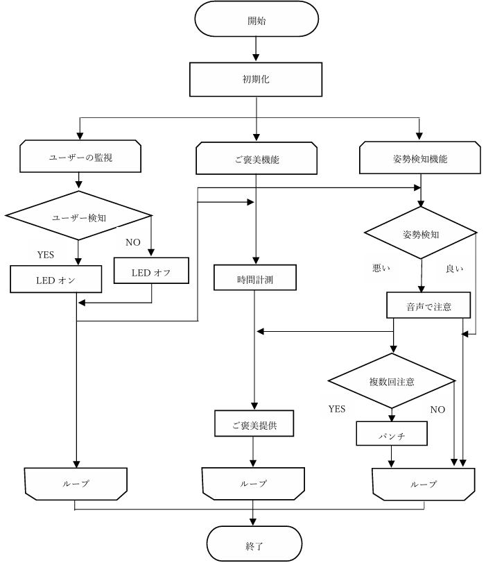

# おかあさんといっしょ(With OKA-SAN) - AI-driven study-assist lighting robot

## Overview
This product is an AI-powered study support lighting robot designed to enhance the efficiency and comfort of study sessions. It features user detection, posture monitoring, and a snack dispensing mechanism to reward sustained focus.

## Key Features

1. **User Detection**  
OKA-SAN uses an ultrasonic sensor to detect when the user is in front of the device. Upon detection, it turns on the LED light and activates other features.
2. **Posture Monitoring**  
Using AI-based posture estimation from camera input, OKA-SAN monitors the user's posture. If poor posture is detected, it provides audio warnings. If the posture does not improve, the robot delivers a playful "punch" to encourage correction.
3. **Snack Dispensing Mechanism**  
After a specified study duration, OKA-SAN dispenses a snack from its left-hand mechanism as a reward for the user's dedication.

### Flowchart
The flowchart below illustrates the main processes of OKA-SAN, including user detection, posture correction, and snack dispensing.  Each component works in a loop to ensure real-time monitoring and feedback.



## Installation
```shell
pip install tensorflow
pip install --upgrade tensorflow-hub
pip install numpy opencv-python matplotlib imageio ipython  pydub pigpio

pip install RPi.GPIO gpiozero

pip install smbus ipget
```

